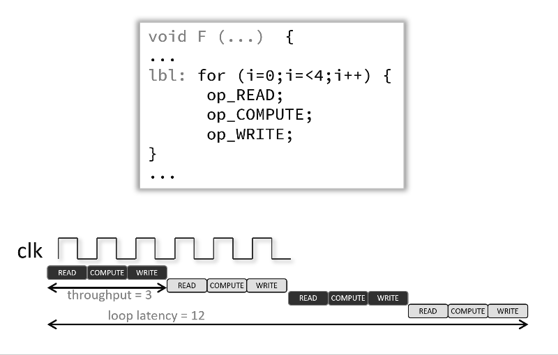

Code, files and instructions for **module 2** (same instructions as in [<b>module 1</b>](../module1_baseline) to setup and run the Vitis tools)

> **_In this module..._**<br>
_1> Pipeline for throughput_<br>
_2> General description of Pipeline_

This module is meant to focus on the pipeline pragma and go through the description below.
The kernel source code with the loops annotated with the pragma will produce the same results as in **module 1**, that's because since simple loops and inner loops (for nested loops) are automatically pipelined by the tool.

## Pipelining for Throughput
The C code high-level synthesis is conservative by default, for example loop body instructions are entirely executed at each iteration instead of a staggered execution.  That latter style of execution is enabled by the PIPELINE pragma, it reduces the initiation interval (II) for a function or loop by allowing the concurrent execution of the different operations.
A pipelined function or loop can then process new inputs every <N> clock cycles, where <N> is the II of the loop or function. The default II for the PIPELINE pragma is 1, which processes a new input every clock cycle. You can also specify the initiation interval through the use of the II option.

Pipelining a loop allows its operations to be implemented in a concurrently as shown in the following animated figure. By default there are 3 clock cycles between each input read (so II=3), and it requires 12 clock cycles fully execute the loop compared to 6 when the pragma is used.



If the Vivado high-level synthesis tool cannot create a design with the specified II, it issues a warning and creates a design with the lowest possible II.
You can then analyze this design with the warning message to determine what steps must be taken to create a design that satisfies the required initiation interval.

To enable the pragma in the C source, insert it within the body of the function or loop.
```cpp
 #pragma HLS pipeline II=<int> enable_flush rewind
```
II=int specifies the desired number of clock cycles between each  initiation interval for the pipeline. The HLS tool tries to meet this request but based on data dependencies, the actual result might have a larger initiation interval. The enable_flush modifier is optional and keeps on pushing data out if the data valid at the input of the pipeline goes inactive. The rewind modifier is also optional and enables continuous loop pipelining with no pause between one loop iteration ending and the next iteration starting. Rewinding is effective only if there is one single loop (or a perfect loop nest) inside the top-level function. 

In the following example function foo is pipelined with an initiation interval of 1:
```cpp
void foo { a, b, c, d} {
  #pragma HLS pipeline II=1
  ...
}
```
Take a look at the kernel source code and notice how the PIPELINE directive is applied for several loops in the code.
Since Vitis HLS automatically pipelines the isn't going to produce different results compared to the baseline.

At this point you can move to [<b>module 3</b>](../module3_dependency_removal) unless you want to verify how these pragmas behave in which case you can run the tools the same way as in module 1.
