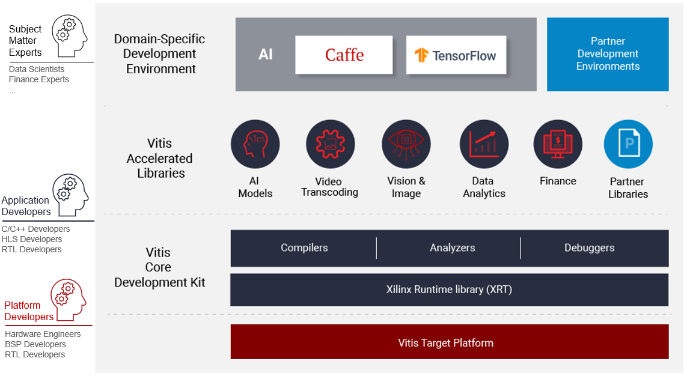

# Vitis and Vitis-AI Workflow

The Vitis unified software platform enables the development of embedded software and accelerated applications on heterogeneous Xilinx platforms including FPGAs, SoCs, and Versal ACAPs. It provides a unified programming model for accelerating Edge, Cloud, and Hybrid computing applications.

## Layered Vitis Software Platform Workflow

Vitis software platform has a layered architecture. It helps engineers to focus on their own target but easy to exchange work results. For example, data scientists or machine learning engineers only needs to work on the domain specific development environments. The result can be converted to Vitis-AI consumable format for further deployment; Application developers takes the machine learning model from data scientists and adopt them to the accelerated libraries provided by Xilinx or partners; Vitis Core Development Kit, runtime and platform layered architecture ensures the service API are stable and provide cross-platform support. The workload to enable a new platform on hardware would be minimal.

There are commonly three types of workflows targeting different persona for Vitis and Vitis AI evaluation and development.

| Workflow           | Target Persona                                               | Highlights in the Flow                                       |
| ------------------ | ------------------------------------------------------------ | ------------------------------------------------------------ |
| Evaluation Flow    | Subject-matter Experts (e.g. Data Scientists)           | Use your industry standard tools plus Xilinx adapters to evaluate accelerated libraries' performance on Xilinx platforms.  Minimal Xilinx-specific toolset requirement. No need to install Vitis or PetaLinux. Vitis AI toolsets are used here for Data Scientists to evaluate machine learning features. |
| Development Flow   | Application Developers                                       | Explore the possibilities with Vitis acceleration on Xilinx platforms. Assemble Xilinx or partner accelerated libraries or develop your own acceleration kernel.  No need to install PetaLinux. |
| Customization Flow | Platform Developers (e.g. Hardware engineers and BSP engineers) | Advanced customization on Xilinx platforms or your own hardware for more input and output interfaces, embedded Linux kernel and root file system configurations, etc. |

In different stages of project development, you may focus on different flows. This tutorial will give the introduction from higher level to lower level: starting from evaluation flow to introduce what one can do in Machine Learning with least Xilinx specific knowledge, to more customization of Xilinx technology for more performance optimization and flexibility. Please refer to each chapter introduction whether you're the target reader of this chapter.

## Vitis-AI Workflow

<To be added>

## Vitis Workflow

To enable hardware acceleration, the code is split between an host  and one or several kernels.  The host program, written in C/C++ uses API abstractions like OpenCL, runs on a host processor (a x86 server or an  ARM processor in the case of embedded platforms).  The hardware  accelerated kernels run onto the programmable logic of a Xilinx device.

The API calls, processed by Xilinx runtime (XRT), manage process  transactions between the host program and the hardware accelerators  (kernels). Communication between the host and the kernel(s), including  control and data transfers, occurs across the PCIe® bus or an AXI bus  for embedded platforms.

In a typical application, the host first transfers data to be  operated on by the kernel from host memory into global memory. The  kernel subsequently operates on the data, storing results back to the  global memory. Upon kernel completion, the host transfers the results  back into the host memory. Data transfers between the host and global  memory introduce latency, which can be costly to the overall  application. To achieve acceleration in a real system, the benefits  achieved by the hardware acceleration kernels must outweigh the added  latency of these data transfers.

In the Vitis™ core development flow helps manage, configure, build and run a host application and hardware accelerated kernels.

- The host application is developed in C/C++ with OpenCL™ API calls
- The hardware kernels can be developed in C/C++, OpenCL C, or RTL.

Here is a diagram of the functional blocks involved for application on ARM to control PL kernels

<Diagram to be added>

## Workflow in this Tutorial

This tutorial will guide you from high level to low level in step-by-step manner. 

We'll start from development environment setup in Section 2.

Section 3 Module 1-3 introduces the Vitis-AI demo setup. Module 4 guides you through the CIFAR10 Classification example using Vitis AI and TensorFlow. Module 5 explains how to switch to other networks. All above are on the "Evaluation Flow" level for Data Scientists for Vitis-AI workflow. 

Section 3 Module 6 introduces how to use Vitis Libraries to speed up pre/post processing for machine learning applications. It brings performance optimization in system level. It's a step in "Development Flow" in the scope of Vitis workflow.

Copyright&copy; 2020 Xilinx

