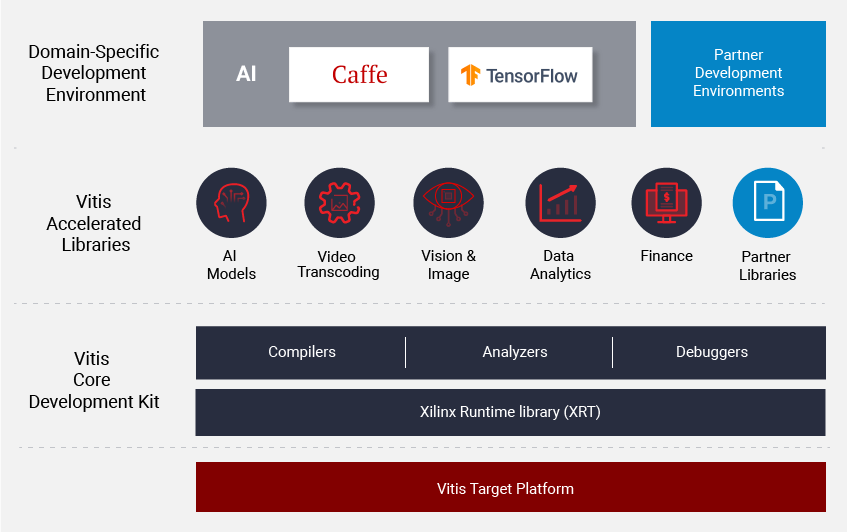

# Vitis and Vitis-AI Workflow

The Vitis unified software platform enables the development of embedded software and accelerated applications on heterogeneous Xilinx platforms including FPGAs, SoCs, and Versal ACAPs. It provides a unified programming model for accelerating Edge, Cloud, and Hybrid computing applications.

Vitis software platform has a layered architecture. It helps engineers to focus on their own target but easy to exchange work results. For example, data scientists or machine learning engineers only needs to work on the domain specific development environments. The result can be converted to Vitis-AI consumable format for further deployment; Application developers takes the machine learning model from data scientists and adopt them to the accelerated libraries provided by Xilinx or partners; Vitis Core Development Kit, runtime and platform layered architecture ensures the service API are stable and provide cross-platform support. The workload to enable a new platform on hardware would be minimal.

There are commonly three types of workflows targeting different persona for Vitis and Vitis AI evaluation and development.

| Workflow           | Target Persona                                                       | Highlights in the Flow                                                                                                                                                                                              |
| ------------------ | -------------------------------------------------------------------- | ------------------------------------------------------------------------------------------------------------------------------------------------------------------------------------------------------------------- |
| Evaluation Flow    | Subject-matter Experts (e.g. Data Scientists)                   | Use your industry standard tools plus Xilinx adapters to evaluate accelerated libraries' performance on Xilinx platforms.  Minimal Xilinx-specific toolset requirement. No need to install Vitis or PetaLinux. |
| Development Flow   | Application Developers                                               | Explore the possibilities with Vitis acceleration on Xilinx platforms. Assemble Xilinx or partner accelerated libraries or develop your own acceleration kernel.  No need to install PetaLinux.                |
| Customization Flow | Platform Developers (e.g. Hardware engineers and BSP engineers) | Advanced customization on Xilinx platforms or your own hardware for more input and output interfaces, embedded Linux kernel and root file system configurations, etc.                                               |

In big teams, engineers are focused in their own development level. In small teams or for independent developers, one person may act as multiple personas. This tutorial will give the introduction from higher level to lower level: starting from evaluation flow to introduce what one can do in Machine Learning with least Xilinx specific knowledge, to more customization of Xilinx technology for more performance optimization and flexibility. Please refer to each chapter introduction whether you're the target reader of this chapter.

Copyright&copy; 2020 Xilinx

