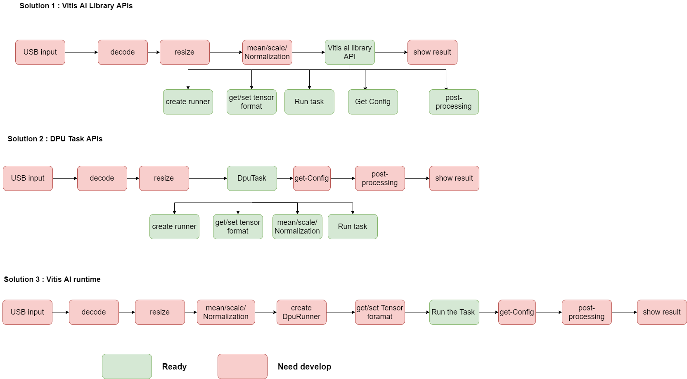
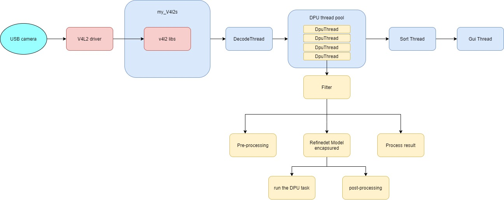

## file instructure
The file directory of this demo is as follows
```
.
├── build.sh
├── include
│   ├── decodethread.hpp
│   ├── dputhread.hpp
│   ├── dpdrm.hpp
│   ├── filter.hpp
│   ├── frameinfo.hpp
│   ├── guithread.hpp
│   ├── mythread.hpp
│   └── sortthread.hpp
├── README.md
├── src
│   ├── decodethread.cpp
│   ├── dputhread.cpp
│   ├── guithread.cpp
│   ├── mythread.cpp
│   └── sortthread.cpp
└── test
    └── usb_input_multi_threads_refinedet.cpp

```
## Solution select





- As the solutions picture show, We provide three APIs, the top-level API is the VITIS AI LIBRARY
The middle API is DPUTASK API and the bottom API is VITIS AI RUNTIME.
- The green modules in the diagram indicate that they are encapsulated in the API.

- In order to separate the resize, mean, scale, normalization operations in the pre-processing, and then use the HLS kernel to accelerate our application, this demo will use the VITIS AI LIBRARY API.

- If you want to implement your own post-processing of the model, you have several options.
    - The first way is that you can find the postprocessing source code and reload the postprocessing functions.
    - You can choose the DPUTASK API, but note that it encapsulates the preprocessing of the algorithm, i.e. you need to give it to DPUTASK, although you can change the values of mean and scale by adjusting the configuration parameters.
    - The most radical way to do this is to just use the VITIS AI RUNTIME API, which only contains only DpuRunner implementation. But you need to prepare your own input and output data structures, and you need to implement your own pre-processing and post-processing.

## App Pipeline
The mean/scale/run DPU task operation on the refindet algorithm model used in this case is encapsulated in the DpuFilter class.
When all threads are running, DecodeThread calls the v4l2 library to decode and put the The raw data into FrameInfo's queue. DpuThread will consume data from the queue. When the queue is empty for a specific duration, DpuThread sets the run flag to stop and all The threads are all stopped. The FrameInfo is passed to SortThread for sorting, and when the sorting is complete, the FrameInfo is sent to DRM's framebuffer in GuiThread, completing the The whole Process.


dataflow:




- Check the device capability
- Get YUV data from device.
- Decode Thread: Convert YUV data into BRG and output the frame queue.
- DPU Thread: Get the frame queue from Decode thread, For this case we will create several DPU threads.
- DPU Filter: The real task execute runner, contains pre-processing, refinedet dpu task, post processing and process result.
- Sort Thead: Get the result from the DPU Thread and sort all the result according to FrameID. output the result to GuiThread to display.
- Gui Thread: displaying the result by using DRM.

## Accelerate the pre-processing by using the HLS kernel.

<p align="center"><sup>Copyright&copy; 2020 Xilinx</sup></p>
