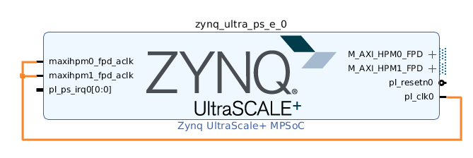
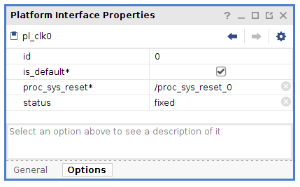

## Example 1: Create a minimum platform for ZCU104

*Vitis and Vivado Version: 2020.1*

### Step 0: Prepare base components

For detailed instructions of how to design a base system, please refer to UG1209 for MPSoC, UG1305 for Versal.

If you're familiar with creating Vivado project and PetaLinux project for MPSoC, please feel free to skip this section and jump to Step 1.

This example is based on ZCU104. It's assumed all platform project files are saved in **~/zcu104_min** directory.

Here's the instructions for a minimum start for the base component.

#### 1. Prepare Hardware Specification in Vivado

1. Launch Vivado
   `vivado &` 
2. Create a Project

| Vitis GUI Instructions                                       |
| ------------------------------------------------------------ |
| Create Project: File -> Project -> New                       |
| Project name: zcu102_min</br>Project location: ~/zcu104_min/vivado </br>Create project subdirectory: checked |
| RTL Project Do not specify sources at this time: checked     |
| Boards: Zynq UltraScale+ ZCU104 Evaluation Board             |
| Finish                                                       |

3. Create Block Diagram

| Vitis GUI Instructions              |
| ----------------------------------- |
| IP Integrator → Create Block Design |
| Design name: zcu104_min             |

4. Add Processing System

| Vitis GUI Instructions         |
| ------------------------------ |
| Add IP: Zynq UltraScale+ MPSoC |

5. Setup PS parameters

| Vitis GUI Instructions      |
| --------------------------- |
| Run Block Automation        |
| Apply Board Preset: checked |

6. Connect signals

| Vitis GUI Instructions                                     |
| ---------------------------------------------------------- |
| Connect pl_clk0 to maxihpm0_fpd_aclk and maxihpm1_fpd_aclk |
| Click save button on tool bar                              |
| Save block diagram with Ctrl+S                             |



7. Add top module

| Vitis GUI Instructions                                       |
| ------------------------------------------------------------ |
| Go to Sources tab                                            |
| Right click on zcu104_min(zcu104_min.bd), select Create HDL Wrapper |
| Select "Let Vivado manage wrapper and auto-update"           |

8. Generate Block Design

| Vitis GUI Instructions        |
| ----------------------------- |
| Click "Generate Block Design" |
| Synthesis Options = Global    |
| Click Generate                |

Note: Global Synthesis skips submodule synthesis when generating block design. It saves time because implementation is not required by Vitis platform XSA.

9. Export XSA

| Vitis GUI Instructions          |
| ------------------------------- |
| File → Export → Export Hardware |
| Platform type: Fixed            |
| Output: Pre-synthesis           |
| XSA file name: zcu104_min       |
| Finish                          |


#### 2. Prepare software components with PetaLinux


1. Create a PetaLinux project in petalinux directory

   

   ```bash
   cd petalinux 
   petalinux-create -t project -n zcu104_min --template zynqMP
   ```

   

2. Import XSA generated by Vivado

   ```bash
   cd zcu104_min # from petalinux directory
   petalinux-config --get-hw-description=../../vivado/zcu104_min --silentconfig
   # --silentconfig prevents the pop-up configuration menu
   ```

   

3. Build PetaLinux project

   ```bash
   petalinux-bulid
   ```

   

4. Package Image

   ```bash
   cd images/linux petalinux-package --boot --u-boot
   ```

   


#### 3. Test Image on board

| Instructions                                                 |
| ------------------------------------------------------------ |
| Copy BOOT.BIN and image.ub to SD card.                       |
| Plugin SD card, Boot the board with SD boot mode. The UART console should print boot log until you see this login prompt. Use root/root to login. |

Console ouptut example:

```
PetaLinux 2019.2 zcu102_min /dev/ttyPS0

zcu102_min login: root
Password:
root@zcu102_min:~#
```

   

   

### Step 1: Add Hardware Interfaces

#### 1. Setup AXI Interfaces

1. Setup AXI Interfaces for IP within the platform

| Vitis GUI Instructions                                       |
| ------------------------------------------------------------ |
| Open the Vivado Block Design if it's not open                |
| Double click **Zynq UltraScale+ MPSoC** block to edit its properties |
| Go to **PS-PL Configuration** -> **PS-PL Interfaces**, Enable master interface **AXI HPM0 LPD** (for interrupt controller) |
| Open menu **Window** → **Platform Interfaces** <br />Click "Enable Platform Interfaces" if it's not enabled |

2. Enable AXI Interface for Kernels' further usage

| Vitis GUI Instructions                                       |
| ------------------------------------------------------------ |
| Open menu **Window** → **Platform Interfaces** <br />Click "Enable Platform Interfaces" if it's not enabled |
| Enable AXI Master port for kernel control: <br />Right click **M_AXI_HPM0_FPD** and select **Enable**<br /> |
| Enable AXI Slave ports for memory:<br />Right click **S_AXI_HP0_FPD** and select **Enable**<br />In **Platform Interface Properties** window, select **Options**, update the following properties:<br />sptag: HP0<br />memory: zynq_ultra_ps_e_0 HP0_DDR_LOW |

#### 2. Setup Clocks

1. Enable clocks for IP in the platform and kernel

| Vitis GUI Instructions                                       |
| ------------------------------------------------------------ |
| Double click **Zynq UltraScale+ MPSoC** block to edit its properties |
| Go to **Clock Configruation** → **Output Clocks** → **Low Power Domain Clocks** → **PL Fabric Clocks** Enable **PL0** for 100MHz |

Note: in this minimal platform, only one 100MHz clock is used. Please enable more clocks if necessary.

4. Add synchronous reset signals for corresponding clocks

| Vitis GUI Instructions                                       |
| ------------------------------------------------------------ |
| Add IP: Processor System Reset                               |
| Click "Run Connection Automation" on the top of diagram      |
| ext_reset_n:  <br />Select Board Part Interface: Custom<br />Select Manual Source: /zynq_ultra_ps_e_0/pl_resetn0 (Active Low) <br /><br />slowest_sync_clk<br />Clock Source: /zynq_ultra_ps_e_0/pl_clk0 |

5. Enable clock for kernel's further usage

| Vitis GUI Instructions                                       |
| ------------------------------------------------------------ |
| In **Platform Interfaces** window, right click **pl_clk0** and select **Enable** |
| In **Platform Interface Properties** window, select **Options**, update the following properties<br />is_default: checked<br /> |

#### 3. Setup Interrupts

1. Add interrupt infrastructures for v++ auto linking

| Vitis GUI Instructions                                       |
| ------------------------------------------------------------ |
| Add IP → AXI Interrupt Controller<br />Default instance name: axi_intc_0 |
| Run Connection Automation<br />Set properties for **s_axi** of **axi_intc_0**<br />Master interface: /zynq_ultra_ps_e_0/M_AXI_HPM0_LPD |
| Add IP → Concat<br />Default instance name: **xlconcat_interrupt_0**Note: this name is used in the final dynamic_postlink.tcl. Please follow this name. |
| Change Concat IP property<br />Number of ports: 32           |
| Add IP → ConstantChange instance name: **xlconstant_gnd**<br />Note: this name is used in the final dynamic_postlink.tcl. Please follow this name. |
| Change Constant IP property<br />Const Val: 0                |
| Right click **xlconstant_gnd**<br />output port **dout**, select **Start Connection Mode**, connect **dout** to each input port of **xlconcat_interrupt_0** |
| Connect **xlconcat_interrupt_0****.dout** to **axi_intc_0.intr** |
| Expand output interface **Interrupt** of **axi_intc_0** to show the port **irq** and connect irq to **zynq_ultra_ps_e_0.pl_ps_irq0** |
| Right click on the diagram and select **Create Hierarchy...**Cell name: **interrupt_concat**Note: this name is used in the final dynamic_postlink.tcl. Please follow this name. |
| Move **xlconcat_interrupt_0** and **xlconstant_gnd** into **interrupt_concat** hierarchy |

Here's a screenshot for the block diagram after executing the operations above.


#### 4. Export XSA

1. Set Platform Properties

```tcl
set_property platform.default_output_type "sd_card" [current_project]
set_property platform.design_intent.embedded "true" [current_project]
set_property platform.design_intent.server_managed "false" [current_project]
set_property platform.design_intent.external_host "false" [current_project]
set_property platform.design_intent.datacenter "false" [current_project]
```

2. Validate the block design

| Vitis GUI Instructions                    |
| ----------------------------------------- |
| In Block Diagram, click "Validate Design" |
| (Optional) Click **Run Implementation**   |

3. Write XSA

```
write_hw_platform -unified -include_bit ./zcu104_min.xsa
```

Note: If "Run Implementation" is skipped in previous step, please omit "-include_bit". The exported XSA won't include bit file.

```
write_hw_platform -unified ./zcu104_min.xsa
```

4. Validate the platform

```
validate_hw_platform ./zcu104_min.xsa
```


### Step 2: Update Software Components to Enable Application Acceleration

#### 1. Update XSA

```bash
cd petalinux/zcu104_min 
petalinux-config --get-hw-description=../../vivado/zcu104_min 
```


#### 2. Add XRT support

```
petalinux-config -c rootfs
```

Enable these packages

- Filesystem Packages → libs → xrt, xrt-dev
- Filesystem Packages → libs → zocl


#### 3. Update device tree to include zocl

Add the following zocl code block to [system-user.dtsi](https://github.com/Xilinx/Vitis_Embedded_Platform_Source/blob/master/Xilinx_Official_Platforms/zcu102_base/petalinux/project-spec/meta-user/recipes-bsp/device-tree/files/system-user.dtsi) in project-spec/meta-user/recipes-bsp/device-tree/files/

```
&amba {
   zyxclmm_drm {
      compatible = "xlnx,zocl";
      status = "okay";
      interrupt-parent = <&axi_intc_0>;
      interrupts = <0  4>, <1  4>, <2  4>, <3  4>,
              <4  4>, <5  4>, <6  4>, <7  4>,
              <8  4>, <9  4>, <10 4>, <11 4>,
              <12 4>, <13 4>, <14 4>, <15 4>,
              <16 4>, <17 4>, <18 4>, <19 4>,
              <20 4>, <21 4>, <22 4>, <23 4>,
              <24 4>, <25 4>, <26 4>, <27 4>,
              <28 4>, <29 4>, <30 4>, <31 4>;
   };
};
```


#### 4. Build Image

```bash
petalinux-build
```


#### 5. Build and install sysroot

```
petalinux-build --sdk
# It takes 10 minutes to 1 hour, depends on the server performance
# sysroot package is generated as a self-extract tar in zcu102_min/petalinux/zcu102_min/images/linux/sdk.sh


cd zcu102_min/petalinux/zcu102_min/images/linux
./sdk.sh
# install the sysroot to /scratch/rickys/work/zcu102_min/pfm/sysroot
```


### Step 3: Wrap a Vitis Acceleration Platform

In step 1 and step 2, we prepared all requirements for Vitis acceleration platforms. We can wrap them together and generate the final Vitis acceleration platform.

#### 1. Create Vitis Platform

| Vitis GUI Workflow                                           |
| ------------------------------------------------------------ |
| Launch Vitis                                                 |
| Set workspace: zcu104_min/pfm                                |
| File → New → Platform Project                                |
| Project name: zcu104_min                                     |
| Create from hardware specification (XSA)                     |
| XSA file: zcu104_min.xsa in Vivado project<br />Operating System: Linux<br />Processor: psu_cortexa53<br />Generate boot components: uncheck |
| Double click zcu102_min/platform.spr, select linux on psu__cortexa53<br />Bif File:<br />Boot Components Directory<br />Linux Image Directory |
| Click hammer icon on tool bar to build platform              |
| Save the export directory for future usage                   |


#### 2. Update platform (optional)

In case the platform source files (XSA or software components) need to be updated, please use the following steps.

| Vitis GUI Flow                                               |
| ------------------------------------------------------------ |
| Right click platform project, select **Update Hardware Specification** |
| Confirm the XSA file location and click OK                   |
| Click hammer icon on toolbar to build the platform           |


### Step 4: Test Your Platform

#### 1. Check with platforminfo utility

```
cd zcu102_min/pfm/zcu104_min/export/zcu104_min/
platforminfo ./zcu104_min.xpfm
```


Please check the clock information, memory information

```
=================
Clock Information
=================
Default Clock Index: 0
Clock Index: 0
Frequency: 99.990005

==================
Memory Information
==================
Bus SP Tag: HP0
```

If XSA is exported with option "include_bit", the report will have a section "Resource Availability".


#### 2. Test with a vadd application

| Vitis GUI Workflow                                           |
| ------------------------------------------------------------ |
| Launch Vitis with new workspace: zcu104_min/test/vadd        |
| File → New → Application Project                             |
| Project Name: vadd                                           |
| Click add icon to add custom platform<br />Select zcu102/pfm/zcu104_min/export<br />Select zcu104_min platform |
| Select sysroot path: zcu104_min/pfm/sysroot/sysroots/aarch64-xilinx-linux |
| Select template: Vector Addition                             |
| Build for hardware<br />Change **Active build configuration**: Hardware<br />Click hammer icon in toolbar |

